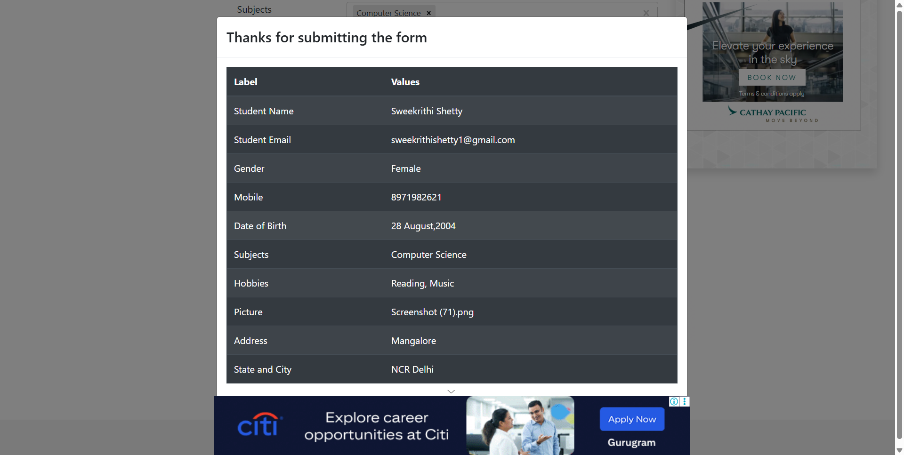

# 📌 Form Filler Automation

This project is a **Selenium automation script** in Python that automatically fills out and submits the [DemoQA Practice Form](https://demoqa.com/automation-practice-form).  
It demonstrates the use of Selenium WebDriver with Python for form filling, file upload, dropdown selection, and automation testing.

---

## 🚀 Features
- Opens **DemoQA Practice Form** in Chrome browser  
- Fills in personal details (Name, Email, Phone Number, Address)  
- Selects gender, date of birth, and subjects  
- Chooses multiple hobbies  
- Uploads a profile picture  
- Selects State and City from dynamic dropdowns  
- Submits the form and captures a screenshot of the submission  

---

## 🛠️ Requirements
Make sure you have the following installed:
- Python 3.x  
- Google Chrome browser  
- ChromeDriver (matching your Chrome version)  
- Selenium  

Install Selenium with pip:
```bash
pip install selenium
```
---
## 📂 Project Structure
```Form-Filler-Automation/
│── form_filler.py        # Main automation script
│── form_submission.png   # Screenshot of successful submission (generated after run)
│── README.md             # Project documentation
```
---
## ▶️ How to Run

Clone this repository:
```
git clone https://github.com/sweekrithishetty28/Form-Filler-Automation.git
cd Form-Filler-Automation
```
Run the script:
```
python form_filler.py
```

The script will:

- Open Chrome browser

- Fill and submit the form

- Save a screenshot as form_submission.png

## 📸 Example Output

After submission, a screenshot is saved:



## 🧑‍💻 Technologies Used

- Python

- Selenium WebDriver

- ChromeDriver

## 📌 Author

Sweekrithi Shetty


